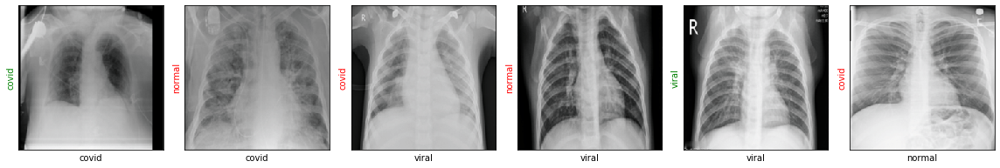
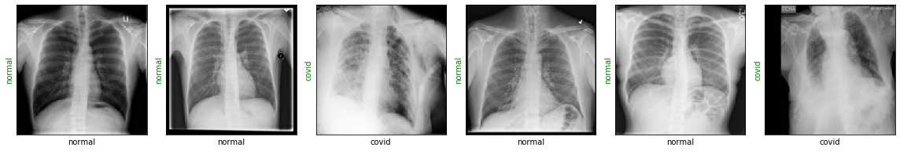
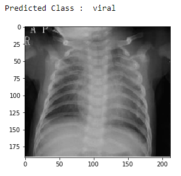

# COVID-19 Detection with Chest X-Ray using ResNet

In this project, an Image Classification Model using Residual Neural Networks (ResNet) has been used to classify image samples of chest X-Ray into 3 classes namely 'Normal', 'Viral' and 'Covid'.

ResNet-18 model of PyTorch Library was used and 15k+ images from [Kaggle](https://www.kaggle.com/tawsifurrahman/covid19-radiography-database) were used to train the model using a 30:70 Split to achieve an accuracy of 98.11% and a Validation Loss of 0.0587. 

## Getting Started

These instructions will give you a copy of the project up and running on
your local machine for development and testing purposes.

### Requirements

- Jupyter
- Python
- Python Libraries
  - PIL
  - Torch
  - TorchVision
  - Shutil
  - Numpy
  - OS
  - Random

## Working 

Classification using Pre Trained ResNet-18 model

Classification after Training ResNet-18 model

After Training the model, it is exported as a .pth file which is now portable and ready to classify Chest X-Ray images.
 
